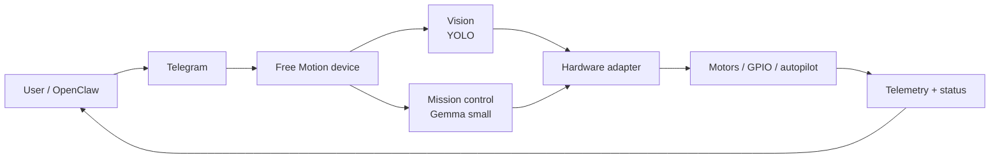

# Free Motion

**Open source AI motion layer for drones, robots, and edge devices.**
OpenClaw sends a command. The device sees, decides, and moves on its own.

[](https://www.python.org/)
[](LICENSE)
[](https://github.com/SpencerBrown1717/Free_Motion/actions/workflows/ci.yml)
[](tests/)

**Site:** [freemotion.tech](https://www.freemotion.tech/) · **Splash:** [spencerbrown1717.github.io/Free_Motion](https://spencerbrown1717.github.io/Free_Motion/) · **Roadmap:** [ROADMAP.md](ROADMAP.md)

## What it does



The device runs locally: perception, decisions, and motion all happen on the edge. Cloud is optional, not required.

## Run the demo in 60 seconds

No hardware, no Telegram, no models. Just the real loop on mock backends.

```bash
git clone https://github.com/SpencerBrown1717/Free_Motion.git
cd Free_Motion
python -m venv .venv && source .venv/bin/activate
pip install -e .
python examples/local_sim_demo.py
```

You'll see five ticks of `intent → vision → mission_control → protocol → router → hardware → state`, with the full wire envelope printed for every dispatched command. Same code path a real device runs; only the backends change.

**Got a Pi?** Graduate to the real bench rig: [`examples/pi_bench_demo/`](examples/pi_bench_demo/) wires `Config.from_env` → `PiHardwareController` → `SafetyGate` → `Router` → `Agent` over Telegram, with two GPIO indicator pins reflecting real hardware state. Walkthrough in [`docs/pi-hardware.md`](docs/pi-hardware.md). More demos and the swap path are in [`docs/demo.md`](docs/demo.md).

## Default stack vs. swappable stack

| Layer | Default (today) | Pluggable interface |
|---|---|---|
| Transport | Telegram | (more transports later) |
| Protocol | v0 (typed envelopes) | stable contract — see [`docs/protocol.md`](docs/protocol.md) |
| Vision | `MockVision` **or** `YoloVision` (post-M4, behind `[yolo]`) | [`VisionBackend`](freemotion/vision/interface.py) |
| Mission control | `MockMissionControl` **or** `GemmaMissionControl` (post-M4, behind `[gemma]`) | [`MissionPolicy`](freemotion/mission_control/interface.py) |
| World state | `WorldStateSnapshot` + `WorldState` (lock-protected) | [`freemotion.world`](freemotion/world/state.py) |
| Hardware | `MockHardwareController` **and** `PiHardwareController` (M4) | [`HardwareController`](freemotion/hardware/interface.py) |
| Safety | `SafetyGate` (M4) — device default is the floor; `dry_run` blocks `arm`/`move`; `stop` always passes | [`SafetyGate`](freemotion/hardware/safety.py), [ADR-0006](docs/decisions.md#adr-0006--safetygate-enforce-safetymode-at-the-hardware-boundary-dry_run-is-the-floor--2026-05-03) |
| Target device | Raspberry Pi (M4 shipped) | Jetson, ESP32, Arduino on the roadmap |

Every layer is a `Protocol` you can implement. See [`docs/models.md`](docs/models.md) for the model swap path and [`docs/pi-hardware.md`](docs/pi-hardware.md) for the Pi adapter.

## Current status

- **Shipped:** Telegram transport (M0); protocol v0 (M1); device runtime — config + router + agent (M2); mock hardware (M2); per-command deny list (M2); vision and mission interfaces + mocks (M3 partial); world state (M3); end-to-end loop demo (M3); Pi hardware controller, bench demo, and SafetyGate (M4); `YoloVision` real perception adapter (post-M4); **`GemmaMissionControl` real decision adapter (post-M4)**.
- **Mocked / not yet real:** higher autonomy (multi-step plans, agent loops, tool use). Out of scope by design — the v1 decision contract is one structured `MissionDecision` per call.
- **Not started:** Jetson / ESP32 / Arduino support (M5).

238 tests passing on every push (plus 1 skip when the optional `[yolo]` extra isn't installed): 22 cover the Pi controller (via `FakeGPIO`), 14 cover the safety gate, 24 cover `YoloVision` (via an injected `yolo_factory` fake), 37 cover `GemmaMissionControl` (via an injected `gemma_factory` fake — CI runs without `transformers` or `torch`). The full state of play is in [`ROADMAP.md`](ROADMAP.md).

## Repository tour

```text
freemotion/
├── protocol/         # v0 envelopes, parser, serializer
├── config/           # frozen Config, env-driven
├── router/           # CommandName -> Handler dispatch (with deny policy)
├── agent/            # Telegram transport + handle_text + builtin handlers
├── hardware/         # HardwareController Protocol + Mock + Pi + SafetyGate
├── vision/           # VisionBackend Protocol + MockVision
├── mission_control/  # MissionPolicy Protocol + MockMissionControl
└── world/            # WorldStateSnapshot + WorldState (thread-safe)

examples/
├── local_sim_demo.py # 60-second laptop demo, no setup
├── mock_drone/       # Telegram + mocks, no hardware
├── pipe_check/       # Smallest Pi check (M0) — optional GPIO LED
└── pi_bench_demo/    # Real Pi (M4) — PiHardwareController + SafetyGate

docs/
├── architecture.md   # how the modules fit
├── decisions.md      # ADR ledger
├── demo.md           # the four demos and what each one proves
├── models.md         # vision + mission control swap path
├── pi-hardware.md    # Pi controller, safety gate, bench flow (M4)
├── pi-runtime.md     # how to write a device on the runtime
├── pi-setup.md       # how to prepare a Pi
├── protocol.md       # command + reply envelope contract
└── issues/           # drafted issue packs + file_issues.sh
```

## Safety and non-goals

This project moves real motors. Trust comes from boundaries.

- **Default safety mode is `dry_run`.** No actuation unless a device explicitly opts in to `bench` or `live`. See [`SAFETY.md`](SAFETY.md).
- **`SafetyGate` is the floor.** `cfg.safety_default` is enforced at the controller boundary; a per-command `safety=bench` against a `dry_run` device is refused. Configuration is the floor, not the ceiling. See [ADR-0006](docs/decisions.md#adr-0006--safetygate-enforce-safetymode-at-the-hardware-boundary-dry_run-is-the-floor--2026-05-03).
- **`stop` is honored unconditionally.** Dispatch always succeeds; handler exceptions can't swallow it; the deny policy can't refuse it; the safety gate can't block it.
- **Auth is not optional.** Chat-id allowlist is enforced at the agent layer; unauthenticated messages never reach a handler.
- **Deny policy is per-device.** Set `FREEMOTION_DENIED_COMMANDS=arm,move` and the router refuses those commands before any handler runs. Refused replies surface `error.code="denied_by_policy"`. `stop` is always exempt.

Non-goals for v0.x:

- Cloud-hosted control plane. Free Motion is edge-first by design.
- A general-purpose autopilot. We ship one narrow loop well; mission control returns one structured next action, not a free-form plan.
- A model zoo. The default stack is YOLO + Gemma small. Other backends are welcome via the interfaces, not in the default install.

## Contributing

The repo crosses the threshold where a stranger can usefully contribute. Three quick paths:

1. **Run [`examples/local_sim_demo.py`](examples/local_sim_demo.py)** and read the code. Open a PR for any rough edge.
2. **Implement a hardware adapter.** `PiHardwareController` is the M4 reference. Jetson, ESP32, Arduino are open against the same `HardwareController` Protocol. See [`docs/pi-hardware.md`](docs/pi-hardware.md) for the bench-rig contract.
3. **Add a second real adapter at the model layer.** `YoloVision` and `GemmaMissionControl` are both shipped (post-M4); a second `VisionBackend` (e.g. ONNX-Runtime for embedded) or `MissionPolicy` (e.g. llama.cpp / hosted endpoint) tests how well the v1 interfaces survive a different shape. See [`docs/models.md`](docs/models.md) for the swap path and [ADR-0007](docs/decisions.md) / [ADR-0008](docs/decisions.md) for the v1 design choices each is built against.

Contribution guide: [`CONTRIBUTING.md`](CONTRIBUTING.md). Architectural decisions live in [`docs/decisions.md`](docs/decisions.md).

## License

[MIT](LICENSE).
