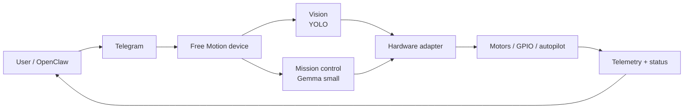

# Free Motion

**Open source AI motion layer for drones, robots, and edge devices.**
OpenClaw sends a command. The device sees, decides, and moves on its own.

[](https://www.python.org/)
[](LICENSE)
[](https://github.com/SpencerBrown1717/Free_Motion/actions/workflows/ci.yml)
[](tests/)

**Site:** [freemotion.tech](https://www.freemotion.tech/) · **Splash:** [spencerbrown1717.github.io/Free_Motion](https://spencerbrown1717.github.io/Free_Motion/) · **Roadmap:** [ROADMAP.md](ROADMAP.md)

## What it does



The device runs locally: perception, decisions, and motion all happen on the edge. Cloud is optional, not required.

## Run the demo in 60 seconds

No hardware, no Telegram, no models. Just the real loop on mock backends.

```bash
git clone https://github.com/SpencerBrown1717/Free_Motion.git
cd Free_Motion
python -m venv .venv && source .venv/bin/activate
pip install -e .
python examples/local_sim_demo.py
```

You'll see five ticks of `intent → vision → mission_control → protocol → router → hardware → state`, with the full wire envelope printed for every dispatched command. Same code path a real device runs; only the backends change.

More demos and the swap path to real hardware are in [`docs/demo.md`](docs/demo.md).

## Default stack vs. swappable stack

| Layer | Default (today) | Pluggable interface |
|---|---|---|
| Transport | Telegram | (more transports later) |
| Protocol | v0 (typed envelopes) | stable contract — see [`docs/protocol.md`](docs/protocol.md) |
| Vision | `MockVision` (real: YOLO, planned) | [`VisionBackend`](freemotion/vision/interface.py) |
| Mission control | `MockMissionControl` (real: Gemma small, planned) | [`MissionPolicy`](freemotion/mission_control/interface.py) |
| World state | `WorldStateSnapshot` + `WorldState` (lock-protected) | [`freemotion.world`](freemotion/world/state.py) |
| Hardware | `MockHardwareController` (real: Pi GPIO, planned) | [`HardwareController`](freemotion/hardware/interface.py) |
| Target device | Raspberry Pi | Jetson, ESP32, Arduino on the roadmap |

Every layer is a `Protocol` you can implement. See [`docs/models.md`](docs/models.md) for the model swap path.

## Current status

- **Shipped:** Telegram transport (M0), protocol v0 (M1), device runtime — config + router + agent (M2), mock hardware (M2), per-command deny list (M2), vision and mission interfaces + mocks (M3 partial), world state (M3), end-to-end loop demo (M3).
- **Mocked, not yet real:** YOLO vision adapter, Gemma small mission policy, Pi hardware controller.
- **Not started:** real hardware demo (M4), Jetson / ESP32 / Arduino support (M5).

124 tests passing on every push. The full state of play is in [`ROADMAP.md`](ROADMAP.md); open work is in [`docs/issues/m2-m3.md`](docs/issues/m2-m3.md).

## Repository tour

```text
freemotion/
├── protocol/         # v0 envelopes, parser, serializer
├── config/           # frozen Config, env-driven
├── router/           # CommandName -> Handler dispatch (with deny policy)
├── agent/            # Telegram transport + handle_text + builtin handlers
├── hardware/         # HardwareController Protocol + MockHardwareController
├── vision/           # VisionBackend Protocol + MockVision
├── mission_control/  # MissionPolicy Protocol + MockMissionControl
└── world/            # WorldStateSnapshot + WorldState (thread-safe)

examples/
├── local_sim_demo.py # 60-second laptop demo, no setup
├── mock_drone/       # Telegram + mocks, no hardware
└── pipe_check/       # Real Pi + optional GPIO LED

docs/
├── architecture.md   # how the modules fit
├── demo.md           # the three demos and what each one proves
├── decisions.md      # ADR ledger
├── models.md         # vision + mission control swap path
├── pi-runtime.md     # how to write a device on the runtime
├── pi-setup.md       # how to prepare a Pi
├── protocol.md       # command + reply envelope contract
└── issues/           # drafted issue packs + file_issues.sh
```

## Safety and non-goals

This project moves real motors. Trust comes from boundaries.

- **Default safety mode is `dry_run`.** No actuation unless a device explicitly opts in to `bench` or `live`. See [`SAFETY.md`](SAFETY.md).
- **`stop` is honored unconditionally.** Dispatch always succeeds; handler exceptions can't swallow it; the deny policy can't refuse it.
- **Auth is not optional.** Chat-id allowlist is enforced at the agent layer; unauthenticated messages never reach a handler.
- **Deny policy is per-device.** Set `FREEMOTION_DENIED_COMMANDS=arm,move` and the router refuses those commands before any handler runs. Refused replies surface `error.code="denied_by_policy"`.

Non-goals for v0.x:

- Cloud-hosted control plane. Free Motion is edge-first by design.
- A general-purpose autopilot. We ship one narrow loop well; mission control returns one structured next action, not a free-form plan.
- A model zoo. The default stack is YOLO + Gemma small. Other backends are welcome via the interfaces, not in the default install.

## Contributing

The repo crosses the threshold where a stranger can usefully contribute. Three quick paths:

1. **Run [`examples/local_sim_demo.py`](examples/local_sim_demo.py)** and read the code. Open a PR for any rough edge.
2. **Pick an issue** from [`docs/issues/m2-m3.md`](docs/issues/m2-m3.md). The next coding session is per-command allow/deny (issue #1).
3. **Implement a backend.** Any of the three Protocols (`VisionBackend`, `MissionPolicy`, `HardwareController`) is open for new implementations.

Contribution guide: [`CONTRIBUTING.md`](CONTRIBUTING.md). Architectural decisions live in [`docs/decisions.md`](docs/decisions.md).

## License

[MIT](LICENSE).
